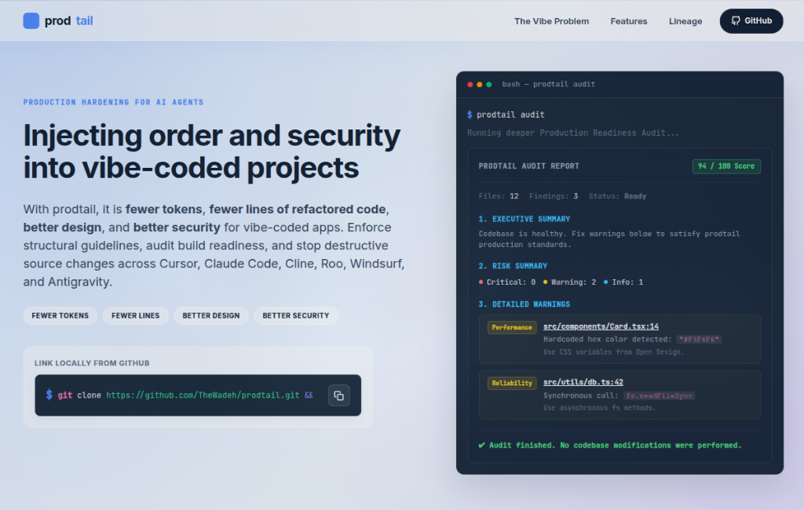

# prodtail

[](https://nodejs.org/)
[](https://opensource.org/licenses/MIT)
[](https://github.com/TheWadeh/prodtail)
[](https://github.com/TheWadeh/prodtail)

Inject and enforce minimalism, production hardening, and design consistency rules across AI coding agents.

With prodtail, it is **fewer tokens**, **fewer lines of refactored code**, **better design**, and **better security** for vibe-coded apps.

`prodtail` checks your codebase for security vulnerabilities, performance bottlenecks, design token drift, SEO metadata errors, and dead code, generating a **Production Readiness Score**. It also configures agent rule instructions for Cursor, Claude Code, Cline, Roo, Windsurf, and Antigravity, and offers a safe file-pruning approval workflow.

---

## 💻 Visual Audit Interface

Here is the visual audit interface of `prodtail` hosted at [prodtail.abdulfetah.site](https://prodtail.abdulfetah.site):



---

## ⚡ The Vibe Coding Pain Points

AI coding agents ("vibe coding") generate code at high speeds, but can skip crucial production reviews. `prodtail` serves as the hardening check layer:

| Vibe Coding Problem | Prodtail Solution | Enforced Rule |
| :--- | :--- | :--- |
| **Bloated Dependencies** | Prioritizes native platform features & standard library options. | `ponytail:minimalism` |
| **Security Leaks** | Blocks credentials, secrets, & API keys in client-side code. | `production:hardening` |
| **Brittle Aesthetics** | Intercepts inline styled components & hardcoded hex values. | `opendesign:aesthetics` |
| **Destructive Refactors** | Computes static dependency trees to block dynamic deletions. | `safety:pruning` |

---

## 🧬 Inspirations & Lineage

`prodtail` unites three core software design directions:

### 1. Inspired by Ponytail (Minimalism)
Adopted strict minimalism principles:
- Prefer boring over clever.
- Use the standard library first.
- Choose native platform features (e.g., standard HTML elements) over custom wrappers.
- Question complex features: *Does the user actually need X, or does Y cover it?*

### 2. Rooted in Open Design (Aesthetics)
Adheres to visual quality guidelines:
- Enforce defined CSS custom property variables and HSL-tailored schemes over hardcoded colors.
- Maintain typographic scales (comfortable line-heights, weights, and fonts like Inter).
- Avoid layout fragmentation (standardize margins, gutters, border-radii, and shadows).

### 3. Fitted for Production (Hardening)
Ensures real-world resilience:
- Prioritize load times and runtime speed (blocking synchronous loop calls).
- Embed SEO metadata (title tags, unique `<h1>` check, search crawlability).
- Handle exceptions and timeouts defensively (default values, custom error fallbacks).

---

## 🚀 Quick Start

### Installation

`prodtail` runs natively on **Node.js v22.6.0+** using native TypeScript type-stripping (no compiler required).

```bash
# Clone the repository
git clone https://github.com/TheWadeh/prodtail.git

# Move to directory
cd prodtail

# Link the executable globally on your system
npm link
```

*Note: Once linked, the `prodtail` command is registered globally on your machine.*

---

## 🛠 Command Guide

### `prodtail init`
Initializes configurations and injects instruction rules into your agent's active workspaces:
*   **Cursor**: `.cursor/rules/prodtail.mdc`
*   **Claude Code**: `CLAUDE.md`
*   **Cline**: `.clinerules`
*   **Roo**: `.roorules`
*   **Windsurf**: `.windsurf/rules/prodtail.md`
*   **Antigravity**: `AGENTS.md` & `.agents/rules/prodtail.md`

> [!NOTE]
> `prodtail init` automatically appends rules directories and files to your local `.gitignore` so they are never committed to your public git branches.

### `prodtail scan`
Performs static checks on files, detecting client environment variables, duplicate code hashes, synchronous loop locks, and inline hex variables.

### `prodtail audit`
Runs the full analysis system, outputs an executive summary, lists warning locations, and calculates the **Production Readiness Score**.

### `prodtail approve [file]`
Scans the project for unused files (or a targeted module) and prompts you to validate deletions based on import safety:
*   **SAFE TO DELETE**: 0 occurrences found in code.
*   **UNCERTAIN**: Found in config configurations or test boundaries.
*   **HIGH RISK**: Actively imported in application entry points.

---

## 📄 License

MIT License. See [LICENSE](LICENSE) for details.
